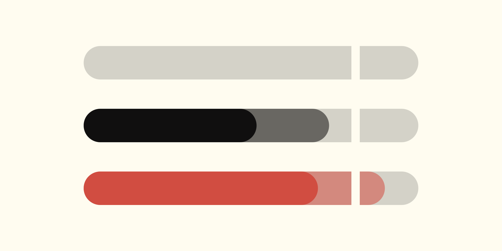

# omarchy-tagwerk

> Today's credited hours against the [tagwerk](https://github.com/espadat-studio/tagwerk) day cap, as a meter in the Omarchy bar

A cap-proximity cue, answering one question: am I close to the day cap, or not? A track, a fill running to today's credited minutes with the paid stretch solid inside it, and the cap as a notch you watch the fill close on. One glance, no arithmetic, nothing to read.



Hover prints work, personal, presence, and the time left or over. Click opens `tagwerk week` in the themed floating terminal.

## Requires

| Dependency | Why |
| ---------- | --- |
| `tagwerk` on `PATH` | The widget runs `tagwerk day --json` and draws its four numbers. Nothing else — it never reads the ledger or the config. Without the CLI the meter stays empty and the tooltip never leaves `reading today`. |
| Omarchy 4 (Quattro) | `omarchy-shell`, its bar, and the Quickshell runtime the QML loads into. |

Install tagwerk first. Its [installation guide](https://tagwerk.espadat.com/getting-started/installation/) covers the AUR package, `tagwerk init`, the systemd units and the hypridle wiring that put minutes in the ledger.

## Install

```sh
omarchy plugin add https://github.com/espadat-studio/omarchy-tagwerk --enable
```

Lands in `~/.config/omarchy/plugins/espadat.tagwerk/` and draws on the right of the bar. `omarchy bar move espadat.tagwerk` relocates it.

## Remove

```sh
omarchy plugin remove espadat.tagwerk
```

Takes it off the bar, then deletes `~/.config/omarchy/plugins/espadat.tagwerk/` outright — a git-cloned plugin leaves no backup folder behind. `omarchy plugin disable espadat.tagwerk` keeps it installed and only takes it off the bar.

## Settings

`refreshIntervalSec`, default 300, range 30-3600. The meter is 4px per hour at an 8-hour cap, so below 15 minutes the fill moves less than a pixel — the interval buys the notch crossing and nothing more.

## What each state looks like

The five states, with what the geometry means, are in the [bar widget documentation](https://tagwerk.espadat.com/bar-widget/).

## Regenerating the preview

`preview/render.sh [theme] [out]` re-renders `preview.png` from `BarWidget.qml`, defaulting to the `flexoki-light` theme it was shot in. It runs a throwaway Quickshell instance under a scratch `HOME`, so the live bar is untouched, and needs a Wayland compositor.

## Report an issue

By symptom, because two repos own two halves of this:

| Symptom | Where |
| ------- | ----- |
| The meter draws wrong, the widget errors, or it breaks on a new Omarchy release | [this repo](https://github.com/espadat-studio/omarchy-tagwerk/issues) — `BarWidget.qml` lives here |
| The hours are wrong, nothing is credited, or the tooltip never leaves `reading today` | [tagwerk](https://github.com/espadat-studio/tagwerk/issues) — the numbers come from `tagwerk day --json` |

Not sure? File it here and it gets moved.

## License

AGPL-3.0-or-later, matching tagwerk. Plugin id `espadat.tagwerk`.
